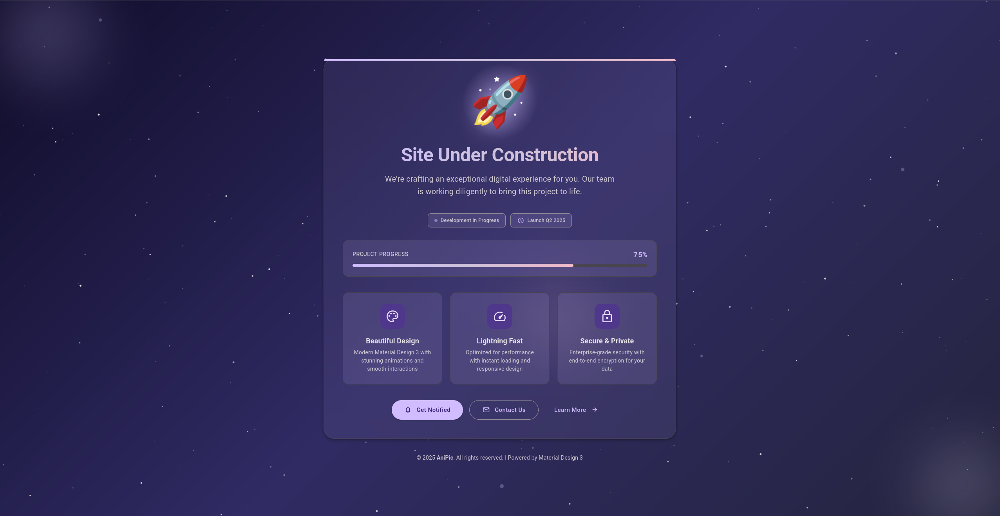

# AniPic - Site Under Construction

🚀 A beautiful "Under Construction" page built with **Material Design 3**.

## Features

### Material Design 3 Implementation
- ✨ Complete MD3 color system (dark theme)
- 🎨 MD3 elevation shadows (5 levels)
- 📐 MD3 shape system (corner radius tokens)
- 🎯 MD3 motion system (easing & duration tokens)

### Visual Effects
- 🌟 Animated starfield background with twinkling stars
- 🌌 Floating cosmic orbs with blur effects
- ✨ Floating particles animation
- 🎨 Aurora gradient effects
- 💫 Icon glow pulse animation

### Interactive Components
- 🔘 Material Design 3 buttons (Filled, Outlined, Text)
- 💧 Ripple effects on all interactive elements
- 🃏 Feature cards with hover animations
- 📊 Animated progress bar with shimmer effect
- 🏷️ Status chips with live indicators
- 🔔 Toast notification system

### User Experience
- 📱 Fully responsive (mobile, tablet, desktop)
- ♿ Accessibility: prefers-reduced-motion support
- ⚡ Performance optimized animations
- 🎨 Smooth transitions with MD3 easing curves
- 💻 Console easter egg for developers

## Design System

### Colors
Based on Material Design 3 color tokens:
- Primary: `#D0BCFF`
- Secondary: `#CCC2DC`
- Tertiary: `#EFB8C8`
- Background: `#1C1B1F`
- Surface layers with elevation tints

### Typography
- Font Family: Roboto (300, 400, 500, 700, 900)
- Monospace: Roboto Mono (for progress percentage)
- Material Symbols Rounded icons

### Motion
- Standard easing: `cubic-bezier(0.2, 0, 0, 1)`
- Emphasized easing: `cubic-bezier(0.05, 0.7, 0.1, 1)`
- Duration tokens: 50ms to 600ms

## Technical Details

### Technologies
- Pure HTML5
- CSS3 with CSS Custom Properties
- Vanilla JavaScript (no frameworks)
- Canvas API for starfield animation
- Material Symbols font icons

### Browser Support
- Modern browsers with CSS Grid support
- Canvas API support required
- CSS Custom Properties required

### Performance
- Optimized star count based on viewport size
- RequestAnimationFrame for smooth animations
- GPU-accelerated transforms
- Efficient DOM manipulation

## Contact

For inquiries, use the "Contact Us" button on the page.

---

© 2025 AniPic. All rights reserved. | Powered by Material Design 3
